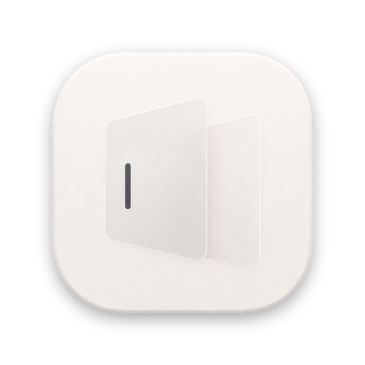
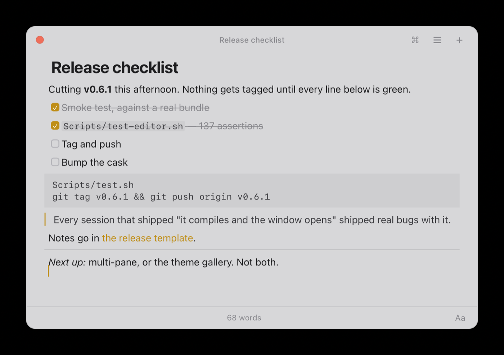
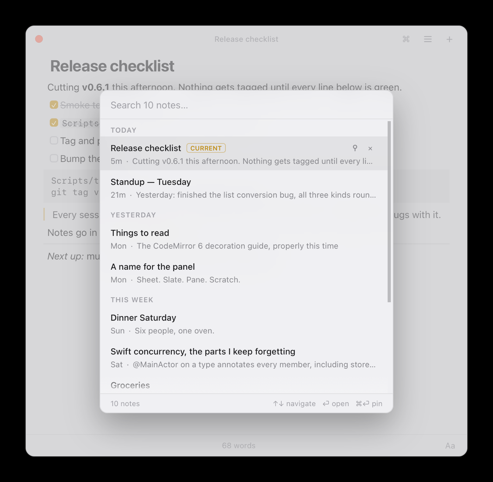
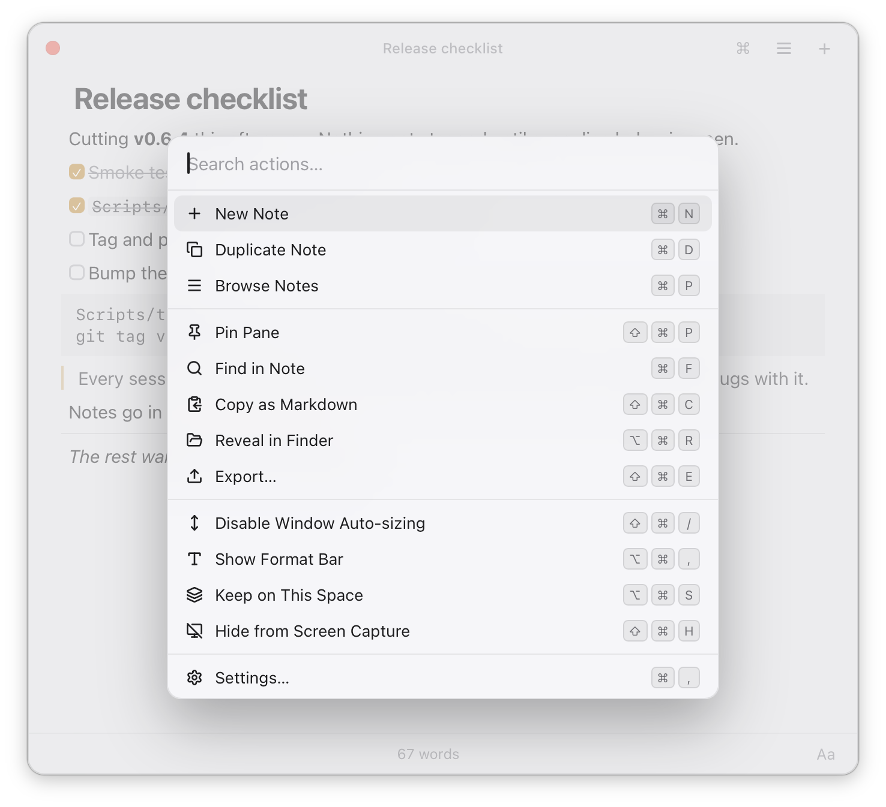
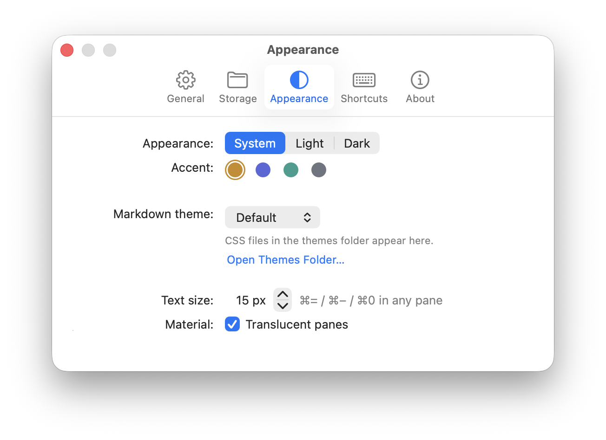
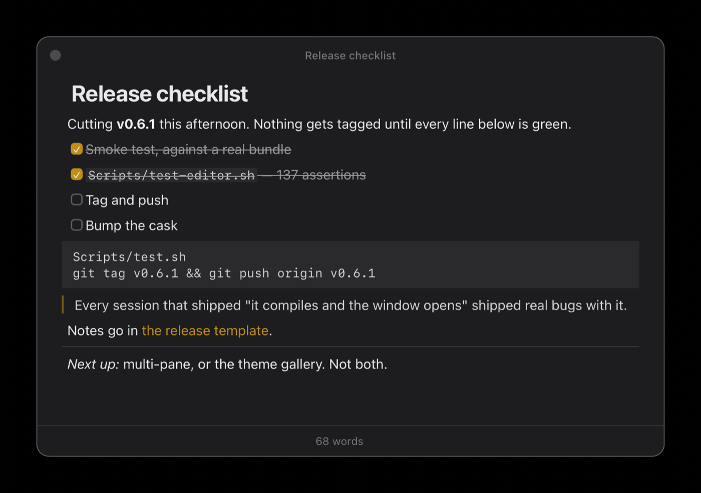

<p align="center">
  
</p>

<h1 align="center">Pane</h1>

<p align="center">
  A sheet of glass over whatever you're doing, that you can write on.
</p>

<p align="center">
  <b>An open-source, file-backed alternative to Raycast Notes for macOS.</b>
</p>

<p align="center">
  <a href="LICENSE"></a>
  
  
  <a href="https://github.com/ColeMei/pane/releases"></a>
</p>

<p align="center">
  
</p>

Press <kbd>⌃⌥Space</kbd> and a panel floats in over your work, caret already in the note you used
last. Type. Press it again and it's gone, caret back where it was. No app switch, no save dialog,
no cold start — summoning Pane doesn't activate it or touch your menu bar.

Your notes are `.md` files in a flat folder you choose. Unlimited, yours, and readable by
everything else you own.

## Install

```bash
brew install --cask ColeMei/pane/pane
```

Or download the `.zip` from the [latest release](https://github.com/ColeMei/pane/releases) and drag
`Pane.app` to `/Applications`.

> [!IMPORTANT]
> **macOS will say Pane "is damaged and can't be opened". It isn't.**
>
> That is what Gatekeeper says about any unsigned app, and right-click → Open no longer gets past
> it. Pane has no Apple Developer ID behind it. Clear the quarantine flag once and it launches
> normally from then on:
>
> ```bash
> xattr -dr com.apple.quarantine /Applications/Pane.app
> ```
>
> Or skip the flag at install time:
>
> ```bash
> brew install --cask --no-quarantine ColeMei/pane/pane
> ```

## Coming from Raycast Notes

Pane is built to the same habits on purpose — same summon-and-type feel, and every shortcut both
apps have uses the same key, so your fingers carry over.

|                | Raycast Notes                    | Pane                                                     |
| -------------- | -------------------------------- | -------------------------------------------------------- |
| Notes          | 5 on the free plan, unlimited on Pro | Unlimited                                              |
| Where they live| Raycast's own storage            | `.md` files in a folder you pick                          |
| Sync           | Cloud Sync, on Pro               | Whatever you already run — iCloud Drive, Syncthing, git   |
| Cost           | Free tier + Pro subscription     | Free, MIT, no account                                     |
| Needs          | The Raycast app                  | Nothing                                                   |

*Not affiliated with or endorsed by Raycast Technologies.*

## What it does

<p align="center">
  
  
</p>

- **Live markdown**, Typora-style — raw syntax shows only on the caret's line, so the rest of the
  note stays rendered while you type.
- **<kbd>⌘P</kbd>** switcher: recency bands, fuzzy title match, full-text search. No results?
  <kbd>⏎</kbd> makes a note titled with what you typed.
- **<kbd>⌘K</kbd>** for everything else — find, export, reveal in Finder, hide from screen capture,
  recently deleted — so the title bar stays at three icons.
- **Deleted notes are recoverable** for as long as you choose, and they wait outside your vault so
  they don't sync back.
- Height follows the note until you drag it. Floats over fullscreen apps, follows you between
  Spaces, menu bar item, launch at login, light and dark.
- External edits are picked up automatically, and **Pane never silently overwrites a file that
  changed underneath it**.

## Your notes

Plain `.md` files, `~/Documents/Pane` by default. What's in the file is what you typed, byte for
byte — no frontmatter, no database.

Filenames are frozen at creation (`2026-08-11-1453-first-few-words.md`) and the title is just the
first line, so editing a title never renames a file. Renames are the biggest single source of
duplicate copies in iCloud Drive and Syncthing. Caret positions, pins and window geometry live in
`~/Library/Application Support/Pane/`, outside the vault, never synced.

## Settings

<p align="center">
  
  
</p>

<kbd>⌘,</kbd> from any pane. Hotkey recorder, vault location, accent, text size, translucency, and
a rebindable table for every in-pane shortcut.

It's all plain JSON in `settings.json`, which Pane watches and re-reads live — so editing it by
hand, over SSH, or from a dotfiles repo works immediately. A **markdown theme is just a CSS file**:
drop one in the themes folder and it appears in Appearance.

## Privacy

Pane requests **no privacy permissions at all** — the global hotkey needs no Accessibility access.
No telemetry, no account, no server. The only network call it ever makes is checking for a new
release, and only when you press the button.

## Build from source

A SwiftPM package plus a web bundle. No Xcode project, on purpose — everything builds with the
Command Line Tools alone.

```bash
Scripts/test.sh                # run the PaneKit suite
Scripts/build-app.sh --debug   # assemble build/Pane.app
```

Swift + AppKit owns the panel, hotkey and file I/O; the editor is CodeMirror 6 in a `WKWebView`.
No Node process, no Rust core, no Electron. The buffer *is* the markdown — live preview is
view-only decoration, so what lands on disk is byte-for-byte what you typed.

## License

MIT

## Acknowledgement

Special thanks to [linux.do](https://linux.do)
